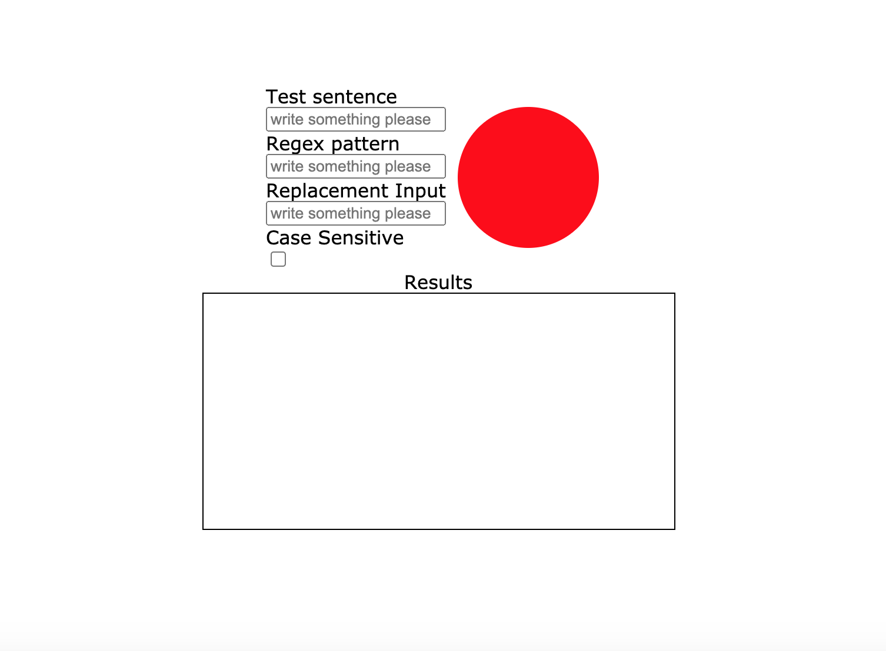

# Regex Generator

* Solo project made by me: [Joelle Everaert](https://github.com/Joelle-Everaert) :blush:
* Type of challenge: training
* duration : half day
* Date : 

## What did we do ?
Creation of a generator to check if our "REGEX" is correct. 

## Context  

During my Web Dev training at **[BeCode](https://becode.org)**

## Purpose?
Put into practice our knowledge learned during the training course.

## Languages used?
* Html (just for the tag script)
* CSS
* Javascript
* Regex

## Overview :collision:
*Click on the picture* :wink:

